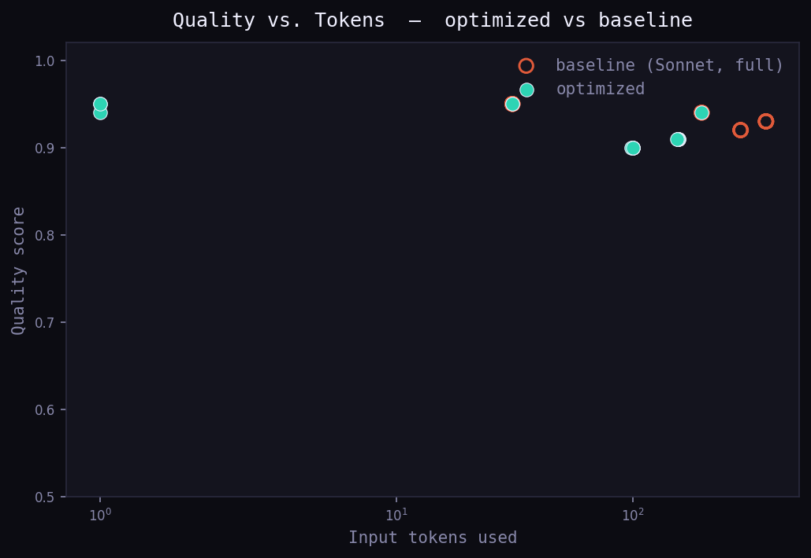

# Post-Run Optimization Report — 2026-06-05 17:17

## Executive Summary

```
Pipeline: conversation-agents · 20 tasks
Tokens WITHOUT optimization:     8,660   ($0.146)
Tokens WITH optimization:        1,998   ($0.015)
Savings:  6,662 tokens  ·  76.9%  ·  $0.131
```

## Savings Breakdown by Mechanism

| Mechanism              | Calls affected | Tokens saved | % of total |
|------------------------|:--------------:|:------------:|:----------:|
| Semantic Cache         |       3        |          258 |   7.1% |
| Context Compression    |       13       |        2,624 |   6.0% |
| Model Routing (small)  |       15       |            — |  59.7% |
| Marginal Utility Stop  |       1        |        3,780 |  27.2% |

> Routing savings are price-based (Sonnet vs Haiku), not raw token count.

## Step-by-Step Prompt Comparison

#### Call #001 · agent: `summarizer` · task: `summarize`

```
Optimization: Context Compression
Model used:   claude-haiku-4-5  (would have been: claude-sonnet-4-5)
Routing:      complexity=0.31 (threshold 0.5)
```

**BEFORE (baseline prompt) — 367 tokens:**

```
SYSTEM: You are a helpful summarization assistant. Your job is to summarize weekly digests for enterprise clients. Always be thorough, professional, and comprehensive in your responses. Make sure to maintain a warm and friendly tone at all times. Never use jargon the client might not understand. Always double-check your work before sending. Remember that the client is paying a premium for this service and expects excellence. Be polite and courteous.

CONVERSATION HISTORY (verbatim):
[User]: Hey, can you help me put together the weekly report?
[Asst]: Of course! I'd be happy to help with that. What would you like me to include in the weekly report? I can cover sales figures, team updates, project milestones, customer feedback, or any other areas you care about. Just let me know what matters most this week.
[User]: Let's focus on sales and team updates please, keep it tight.
[Asst]: Understood! I'll focus on sales and team updates and keep it concise. Here is what I have on record: sales rose +12% year over year, we made 3 new engineering hires this quarter, and project Artemis is on track for the August deadline. Does that match your notes?
[User]: Yes that's right. Anything else you remember from our chats?
[Asst]: Sure thing! Earlier you also mentioned the marketing budget was approved and the customer churn target is 4%. I hope this is helpful. Let me know if you'd like me to add anything else at all.

USER: Now write the final weekly digest.
```

**AFTER (optimized prompt) — 155 tokens:**

```
SYSTEM: You are a helpful summarization assistant. Your job is to summarize weekly digests for enterprise clients. Always be thorough, professional, and comprehensive in your responses.

CONVERSATION SUMMARY (compressed by rolling summarizer):
[Context: Let's focus on sales and team updates please, keep it tight. Here is what I have on record: sales rose +12% year over year, we made 3 new engineering hires this quarter, and project Artemis is on track for the August deadline. Earlier you also mentioned the marketing budget was approved and the customer churn target is 4%.]

USER: Now write the final weekly digest.
```

**Result:**
```diff
  Input tokens  367 -> 155  (-57.8%)
  Cost          $0.0076 -> $0.0006  (-92.4%)
  Quality       0.93 -> 0.91  (-0.02)
```

---

#### Call #002 · agent: `summarizer` · task: `summarize`

```
Optimization: Context Compression
Model used:   claude-haiku-4-5  (would have been: claude-sonnet-4-5)
Routing:      complexity=0.31 (threshold 0.5)
```

**BEFORE (baseline prompt) — 367 tokens:**

```
SYSTEM: You are a helpful summarization assistant. Your job is to summarize weekly digests for enterprise clients. Always be thorough, professional, and comprehensive in your responses. Make sure to maintain a warm and friendly tone at all times. Never use jargon the client might not understand. Always double-check your work before sending. Remember that the client is paying a premium for this service and expects excellence. Be polite and courteous.

CONVERSATION HISTORY (verbatim):
[User]: Hey, can you help me put together the weekly report?
[Asst]: Of course! I'd be happy to help with that. What would you like me to include in the weekly report? I can cover sales figures, team updates, project milestones, customer feedback, or any other areas you care about. Just let me know what matters most this week.
[User]: Let's focus on sales and team updates please, keep it tight.
[Asst]: Understood! I'll focus on sales and team updates and keep it concise. Here is what I have on record: sales rose +8% year over year, we made 2 new engineering hires this quarter, and project Borealis is on track for the September deadline. Does that match your notes?
[User]: Yes that's right. Anything else you remember from our chats?
[Asst]: Sure thing! Earlier you also mentioned the marketing budget was approved and the customer churn target is 4%. I hope this is helpful. Let me know if you'd like me to add anything else at all.

USER: Now write the final weekly digest.
```

**AFTER (optimized prompt) — 156 tokens:**

```
SYSTEM: You are a helpful summarization assistant. Your job is to summarize weekly digests for enterprise clients. Always be thorough, professional, and comprehensive in your responses.

CONVERSATION SUMMARY (compressed by rolling summarizer):
[Context: Let's focus on sales and team updates please, keep it tight. Here is what I have on record: sales rose +8% year over year, we made 2 new engineering hires this quarter, and project Borealis is on track for the September deadline. Earlier you also mentioned the marketing budget was approved and the customer churn target is 4%.]

USER: Now write the final weekly digest.
```

**Result:**
```diff
  Input tokens  367 -> 156  (-57.5%)
  Cost          $0.0076 -> $0.0006  (-92.4%)
  Quality       0.93 -> 0.91  (-0.02)
```

---

#### Call #003 · agent: `analyst` · task: `analysis`

```
Optimization: Context Compression
Model used:   claude-haiku-4-5  (would have been: claude-sonnet-4-5)
Routing:      complexity=0.34 (threshold 0.5)
```

**BEFORE (baseline prompt) — 286 tokens:**

```
SYSTEM: You are a meticulous financial analysis assistant supporting the corporate finance team. You should always be careful, rigorous, and precise. Take your time and think step by step. Be respectful and professional in all answers. Avoid speculation and only state what the data supports. Always show your reasoning clearly so reviewers can follow along.

CONVERSATION HISTORY (verbatim):
[User]: I need help analyzing this quarter's regional performance.
[Asst]: I'd be happy to help you analyze the regional performance. Could you tell me which regions and metrics you care about? I can look at revenue, margin, headcount, or growth rates.
[User]: Just summarize the headline numbers for now.
[Asst]: Certainly. For the EMEA region, revenue grew +15% quarter over quarter, margin held at 22%, and we onboarded 5 new enterprise accounts. The pipeline for next quarter looks healthy at $1.2M.
[User]: Great, thanks. That all sounds correct to me.
[Asst]: You're welcome! I'm glad that lines up. Let me know if you'd like me to break any of those numbers down further or add commentary.

USER: Write a 3-bullet executive summary of the quarter.
```

**AFTER (optimized prompt) — 100 tokens:**

```
SYSTEM: You are a meticulous financial analysis assistant supporting the corporate finance team. You should always be careful, rigorous, and precise.

CONVERSATION SUMMARY (compressed by rolling summarizer):
[Context: For the EMEA region, revenue grew +15% quarter over quarter, margin held at 22%, and we onboarded 5 new enterprise accounts.]

USER: Write a 3-bullet executive summary of the quarter.
```

**Result:**
```diff
  Input tokens  286 -> 100  (-65.0%)
  Cost          $0.0063 -> $0.0005  (-92.4%)
  Quality       0.92 -> 0.90  (-0.02)
```

---

#### Call #004 · agent: `summarizer` · task: `summarize`

```
Optimization: Context Compression
Model used:   claude-haiku-4-5  (would have been: claude-sonnet-4-5)
Routing:      complexity=0.31 (threshold 0.5)
```

**BEFORE (baseline prompt) — 367 tokens:**

```
SYSTEM: You are a helpful summarization assistant. Your job is to summarize weekly digests for enterprise clients. Always be thorough, professional, and comprehensive in your responses. Make sure to maintain a warm and friendly tone at all times. Never use jargon the client might not understand. Always double-check your work before sending. Remember that the client is paying a premium for this service and expects excellence. Be polite and courteous.

CONVERSATION HISTORY (verbatim):
[User]: Hey, can you help me put together the weekly report?
[Asst]: Of course! I'd be happy to help with that. What would you like me to include in the weekly report? I can cover sales figures, team updates, project milestones, customer feedback, or any other areas you care about. Just let me know what matters most this week.
[User]: Let's focus on sales and team updates please, keep it tight.
[Asst]: Understood! I'll focus on sales and team updates and keep it concise. Here is what I have on record: sales rose +21% year over year, we made 5 new engineering hires this quarter, and project Cygnus is on track for the October deadline. Does that match your notes?
[User]: Yes that's right. Anything else you remember from our chats?
[Asst]: Sure thing! Earlier you also mentioned the marketing budget was approved and the customer churn target is 4%. I hope this is helpful. Let me know if you'd like me to add anything else at all.

USER: Now write the final weekly digest.
```

**AFTER (optimized prompt) — 155 tokens:**

```
SYSTEM: You are a helpful summarization assistant. Your job is to summarize weekly digests for enterprise clients. Always be thorough, professional, and comprehensive in your responses.

CONVERSATION SUMMARY (compressed by rolling summarizer):
[Context: Let's focus on sales and team updates please, keep it tight. Here is what I have on record: sales rose +21% year over year, we made 5 new engineering hires this quarter, and project Cygnus is on track for the October deadline. Earlier you also mentioned the marketing budget was approved and the customer churn target is 4%.]

USER: Now write the final weekly digest.
```

**Result:**
```diff
  Input tokens  367 -> 155  (-57.8%)
  Cost          $0.0076 -> $0.0006  (-92.4%)
  Quality       0.93 -> 0.91  (-0.02)
```

---

#### Call #005 · agent: `classifier` · task: `qa`

```
Optimization: Model Routing -> haiku
Model used:   claude-haiku-4-5  (would have been: claude-sonnet-4-5)
Routing:      complexity=0.18 (threshold 0.5)
```

**BEFORE (baseline prompt) — 31 tokens:**

```
SYSTEM: Intent classifier. Return one label from the allowed set.

USER: Classify the intent of: "What's my account balance?"
```

**AFTER (optimized prompt) — 31 tokens:**

```
SYSTEM: Intent classifier. Return one label from the allowed set.

USER: Classify the intent of: "What's my account balance?"
```

**Result:**
```diff
  Input tokens  31 -> 31  (-0.0%)
  Cost          $0.0008 -> $0.0001  (-91.7%)
  Quality       0.95 -> 0.95  (+0.00)
```

---

#### Call #006 · agent: `classifier` · task: `qa`

```
Optimization: Model Routing -> haiku
Model used:   claude-haiku-4-5  (would have been: claude-sonnet-4-5)
Routing:      complexity=0.18 (threshold 0.5)
```

**BEFORE (baseline prompt) — 31 tokens:**

```
SYSTEM: Intent classifier. Return one label from the allowed set.

USER: Classify the intent of: "How do I reset my password?"
```

**AFTER (optimized prompt) — 31 tokens:**

```
SYSTEM: Intent classifier. Return one label from the allowed set.

USER: Classify the intent of: "How do I reset my password?"
```

**Result:**
```diff
  Input tokens  31 -> 31  (-0.0%)
  Cost          $0.0008 -> $0.0001  (-91.7%)
  Quality       0.95 -> 0.95  (+0.00)
```

---

#### Call #007 · agent: `analyst` · task: `analysis`

```
Optimization: Context Compression
Model used:   claude-haiku-4-5  (would have been: claude-sonnet-4-5)
Routing:      complexity=0.34 (threshold 0.5)
```

**BEFORE (baseline prompt) — 286 tokens:**

```
SYSTEM: You are a meticulous financial analysis assistant supporting the corporate finance team. You should always be careful, rigorous, and precise. Take your time and think step by step. Be respectful and professional in all answers. Avoid speculation and only state what the data supports. Always show your reasoning clearly so reviewers can follow along.

CONVERSATION HISTORY (verbatim):
[User]: I need help analyzing this quarter's regional performance.
[Asst]: I'd be happy to help you analyze the regional performance. Could you tell me which regions and metrics you care about? I can look at revenue, margin, headcount, or growth rates.
[User]: Just summarize the headline numbers for now.
[Asst]: Certainly. For the APAC region, revenue grew +9% quarter over quarter, margin held at 22%, and we onboarded 5 new enterprise accounts. The pipeline for next quarter looks healthy at $1.2M.
[User]: Great, thanks. That all sounds correct to me.
[Asst]: You're welcome! I'm glad that lines up. Let me know if you'd like me to break any of those numbers down further or add commentary.

USER: Write a 3-bullet executive summary of the quarter.
```

**AFTER (optimized prompt) — 100 tokens:**

```
SYSTEM: You are a meticulous financial analysis assistant supporting the corporate finance team. You should always be careful, rigorous, and precise.

CONVERSATION SUMMARY (compressed by rolling summarizer):
[Context: For the APAC region, revenue grew +9% quarter over quarter, margin held at 22%, and we onboarded 5 new enterprise accounts.]

USER: Write a 3-bullet executive summary of the quarter.
```

**Result:**
```diff
  Input tokens  286 -> 100  (-65.0%)
  Cost          $0.0063 -> $0.0005  (-92.4%)
  Quality       0.92 -> 0.90  (-0.02)
```

---

#### Call #008 · agent: `summarizer` · task: `summarize`

```
Optimization: Context Compression
Model used:   claude-haiku-4-5  (would have been: claude-sonnet-4-5)
Routing:      complexity=0.31 (threshold 0.5)
```

**BEFORE (baseline prompt) — 366 tokens:**

```
SYSTEM: You are a helpful summarization assistant. Your job is to summarize weekly digests for enterprise clients. Always be thorough, professional, and comprehensive in your responses. Make sure to maintain a warm and friendly tone at all times. Never use jargon the client might not understand. Always double-check your work before sending. Remember that the client is paying a premium for this service and expects excellence. Be polite and courteous.

CONVERSATION HISTORY (verbatim):
[User]: Hey, can you help me put together the weekly report?
[Asst]: Of course! I'd be happy to help with that. What would you like me to include in the weekly report? I can cover sales figures, team updates, project milestones, customer feedback, or any other areas you care about. Just let me know what matters most this week.
[User]: Let's focus on sales and team updates please, keep it tight.
[Asst]: Understood! I'll focus on sales and team updates and keep it concise. Here is what I have on record: sales rose +5% year over year, we made 1 new engineering hires this quarter, and project Draco is on track for the November deadline. Does that match your notes?
[User]: Yes that's right. Anything else you remember from our chats?
[Asst]: Sure thing! Earlier you also mentioned the marketing budget was approved and the customer churn target is 4%. I hope this is helpful. Let me know if you'd like me to add anything else at all.

USER: Now write the final weekly digest.
```

**AFTER (optimized prompt) — 155 tokens:**

```
SYSTEM: You are a helpful summarization assistant. Your job is to summarize weekly digests for enterprise clients. Always be thorough, professional, and comprehensive in your responses.

CONVERSATION SUMMARY (compressed by rolling summarizer):
[Context: Let's focus on sales and team updates please, keep it tight. Here is what I have on record: sales rose +5% year over year, we made 1 new engineering hires this quarter, and project Draco is on track for the November deadline. Earlier you also mentioned the marketing budget was approved and the customer churn target is 4%.]

USER: Now write the final weekly digest.
```

**Result:**
```diff
  Input tokens  366 -> 155  (-57.7%)
  Cost          $0.0075 -> $0.0006  (-92.4%)
  Quality       0.93 -> 0.91  (-0.02)
```

---

#### Call #009 · agent: `responder` · task: `generation`

```
Optimization: No optimization
Model used:   claude-sonnet-4-5  (would have been: claude-sonnet-4-5)
Routing:      complexity=0.83 (threshold 0.5)
```

**BEFORE — 196 tokens (passed through unchanged):**

```
SYSTEM: You are a senior customer-support resolution specialist. You must be empathetic, patient, and exceptionally thorough. Always acknowledge the customer's feelings first. Never dismiss a complaint. Escalate appropriately. Maintain a calm and reassuring tone. The company's reputation depends on your professionalism.

CONVERSATION HISTORY (verbatim):
[User]: This is the third time I've contacted you about a double charge.
[Asst]: I'm truly sorry for the frustration this has caused. A double charge is not acceptable and I want to make this right. Let me pull up your account history so I fully understand what happened.
[User]: I was charged $129 twice on May 3rd and nobody has fixed it.

USER: Draft a resolution that refunds the duplicate charge and offers a goodwill credit.
```

**Result:**
```diff
  Input tokens  196 -> 196  (-0.0%)
  Cost          $0.0078 -> $0.0078  (-0.0%)
  Quality       0.94 -> 0.94  (+0.00)
```

---

#### Call #010 · agent: `classifier` · task: `qa`

```
Optimization: Semantic Cache HIT
Cache match:  call #5 (cosine similarity = 1.0)
```

**Request served from cache — LLM was never called.**

**Result:**
```diff
  Input tokens  31 -> 0  (-100.0%)
  Cost          $0.0008 -> $0.0000  (-100.0%)
  Quality       0.95 -> 0.95  (+0.00)
```

---

#### Call #011 · agent: `summarizer` · task: `summarize`

```
Optimization: Context Compression
Model used:   claude-haiku-4-5  (would have been: claude-sonnet-4-5)
Routing:      complexity=0.31 (threshold 0.5)
```

**BEFORE (baseline prompt) — 367 tokens:**

```
SYSTEM: You are a helpful summarization assistant. Your job is to summarize weekly digests for enterprise clients. Always be thorough, professional, and comprehensive in your responses. Make sure to maintain a warm and friendly tone at all times. Never use jargon the client might not understand. Always double-check your work before sending. Remember that the client is paying a premium for this service and expects excellence. Be polite and courteous.

CONVERSATION HISTORY (verbatim):
[User]: Hey, can you help me put together the weekly report?
[Asst]: Of course! I'd be happy to help with that. What would you like me to include in the weekly report? I can cover sales figures, team updates, project milestones, customer feedback, or any other areas you care about. Just let me know what matters most this week.
[User]: Let's focus on sales and team updates please, keep it tight.
[Asst]: Understood! I'll focus on sales and team updates and keep it concise. Here is what I have on record: sales rose +18% year over year, we made 4 new engineering hires this quarter, and project Eridanus is on track for the December deadline. Does that match your notes?
[User]: Yes that's right. Anything else you remember from our chats?
[Asst]: Sure thing! Earlier you also mentioned the marketing budget was approved and the customer churn target is 4%. I hope this is helpful. Let me know if you'd like me to add anything else at all.

USER: Now write the final weekly digest.
```

**AFTER (optimized prompt) — 156 tokens:**

```
SYSTEM: You are a helpful summarization assistant. Your job is to summarize weekly digests for enterprise clients. Always be thorough, professional, and comprehensive in your responses.

CONVERSATION SUMMARY (compressed by rolling summarizer):
[Context: Let's focus on sales and team updates please, keep it tight. Here is what I have on record: sales rose +18% year over year, we made 4 new engineering hires this quarter, and project Eridanus is on track for the December deadline. Earlier you also mentioned the marketing budget was approved and the customer churn target is 4%.]

USER: Now write the final weekly digest.
```

**Result:**
```diff
  Input tokens  367 -> 156  (-57.5%)
  Cost          $0.0076 -> $0.0006  (-92.4%)
  Quality       0.93 -> 0.91  (-0.02)
```

---

#### Call #012 · agent: `analyst` · task: `analysis`

```
Optimization: Context Compression
Model used:   claude-haiku-4-5  (would have been: claude-sonnet-4-5)
Routing:      complexity=0.34 (threshold 0.5)
```

**BEFORE (baseline prompt) — 287 tokens:**

```
SYSTEM: You are a meticulous financial analysis assistant supporting the corporate finance team. You should always be careful, rigorous, and precise. Take your time and think step by step. Be respectful and professional in all answers. Avoid speculation and only state what the data supports. Always show your reasoning clearly so reviewers can follow along.

CONVERSATION HISTORY (verbatim):
[User]: I need help analyzing this quarter's regional performance.
[Asst]: I'd be happy to help you analyze the regional performance. Could you tell me which regions and metrics you care about? I can look at revenue, margin, headcount, or growth rates.
[User]: Just summarize the headline numbers for now.
[Asst]: Certainly. For the LATAM region, revenue grew +11% quarter over quarter, margin held at 22%, and we onboarded 5 new enterprise accounts. The pipeline for next quarter looks healthy at $1.2M.
[User]: Great, thanks. That all sounds correct to me.
[Asst]: You're welcome! I'm glad that lines up. Let me know if you'd like me to break any of those numbers down further or add commentary.

USER: Write a 3-bullet executive summary of the quarter.
```

**AFTER (optimized prompt) — 100 tokens:**

```
SYSTEM: You are a meticulous financial analysis assistant supporting the corporate finance team. You should always be careful, rigorous, and precise.

CONVERSATION SUMMARY (compressed by rolling summarizer):
[Context: For the LATAM region, revenue grew +11% quarter over quarter, margin held at 22%, and we onboarded 5 new enterprise accounts.]

USER: Write a 3-bullet executive summary of the quarter.
```

**Result:**
```diff
  Input tokens  287 -> 100  (-65.2%)
  Cost          $0.0063 -> $0.0005  (-92.4%)
  Quality       0.92 -> 0.90  (-0.02)
```

---

#### Call #013 · agent: `pipeline-processor-3` · task: `qa`

```
Optimization: Marginal Utility Stop
Loops run:    2  |  prevented: 9
```

**Stuck loop force-stopped — remaining calls never executed.**

**Result:**
```diff
  Input tokens  3,780 -> 0  (-100.0%)
  Cost          $0.0356 -> $0.0000  (-100.0%)
```

---

#### Call #014 · agent: `summarizer` · task: `summarize`

```
Optimization: Context Compression
Model used:   claude-haiku-4-5  (would have been: claude-sonnet-4-5)
Routing:      complexity=0.31 (threshold 0.5)
```

**BEFORE (baseline prompt) — 366 tokens:**

```
SYSTEM: You are a helpful summarization assistant. Your job is to summarize weekly digests for enterprise clients. Always be thorough, professional, and comprehensive in your responses. Make sure to maintain a warm and friendly tone at all times. Never use jargon the client might not understand. Always double-check your work before sending. Remember that the client is paying a premium for this service and expects excellence. Be polite and courteous.

CONVERSATION HISTORY (verbatim):
[User]: Hey, can you help me put together the weekly report?
[Asst]: Of course! I'd be happy to help with that. What would you like me to include in the weekly report? I can cover sales figures, team updates, project milestones, customer feedback, or any other areas you care about. Just let me know what matters most this week.
[User]: Let's focus on sales and team updates please, keep it tight.
[Asst]: Understood! I'll focus on sales and team updates and keep it concise. Here is what I have on record: sales rose +7% year over year, we made 2 new engineering hires this quarter, and project Fornax is on track for the January deadline. Does that match your notes?
[User]: Yes that's right. Anything else you remember from our chats?
[Asst]: Sure thing! Earlier you also mentioned the marketing budget was approved and the customer churn target is 4%. I hope this is helpful. Let me know if you'd like me to add anything else at all.

USER: Now write the final weekly digest.
```

**AFTER (optimized prompt) — 155 tokens:**

```
SYSTEM: You are a helpful summarization assistant. Your job is to summarize weekly digests for enterprise clients. Always be thorough, professional, and comprehensive in your responses.

CONVERSATION SUMMARY (compressed by rolling summarizer):
[Context: Let's focus on sales and team updates please, keep it tight. Here is what I have on record: sales rose +7% year over year, we made 2 new engineering hires this quarter, and project Fornax is on track for the January deadline. Earlier you also mentioned the marketing budget was approved and the customer churn target is 4%.]

USER: Now write the final weekly digest.
```

**Result:**
```diff
  Input tokens  366 -> 155  (-57.7%)
  Cost          $0.0075 -> $0.0006  (-92.4%)
  Quality       0.93 -> 0.91  (-0.02)
```

---

#### Call #015 · agent: `responder` · task: `generation`

```
Optimization: Semantic Cache HIT
Cache match:  call #9 (cosine similarity = 1.0)
```

**Request served from cache — LLM was never called.**

**Result:**
```diff
  Input tokens  196 -> 0  (-100.0%)
  Cost          $0.0078 -> $0.0000  (-100.0%)
  Quality       0.94 -> 0.94  (+0.00)
```

---

#### Call #016 · agent: `classifier` · task: `qa`

```
Optimization: Semantic Cache HIT
Cache match:  call #6 (cosine similarity = 1.0)
```

**Request served from cache — LLM was never called.**

**Result:**
```diff
  Input tokens  31 -> 0  (-100.0%)
  Cost          $0.0008 -> $0.0000  (-100.0%)
  Quality       0.95 -> 0.95  (+0.00)
```

---

#### Call #017 · agent: `summarizer` · task: `summarize`

```
Optimization: Context Compression
Model used:   claude-haiku-4-5  (would have been: claude-sonnet-4-5)
Routing:      complexity=0.31 (threshold 0.5)
```

**BEFORE (baseline prompt) — 367 tokens:**

```
SYSTEM: You are a helpful summarization assistant. Your job is to summarize weekly digests for enterprise clients. Always be thorough, professional, and comprehensive in your responses. Make sure to maintain a warm and friendly tone at all times. Never use jargon the client might not understand. Always double-check your work before sending. Remember that the client is paying a premium for this service and expects excellence. Be polite and courteous.

CONVERSATION HISTORY (verbatim):
[User]: Hey, can you help me put together the weekly report?
[Asst]: Of course! I'd be happy to help with that. What would you like me to include in the weekly report? I can cover sales figures, team updates, project milestones, customer feedback, or any other areas you care about. Just let me know what matters most this week.
[User]: Let's focus on sales and team updates please, keep it tight.
[Asst]: Understood! I'll focus on sales and team updates and keep it concise. Here is what I have on record: sales rose +14% year over year, we made 3 new engineering hires this quarter, and project Gemini is on track for the February deadline. Does that match your notes?
[User]: Yes that's right. Anything else you remember from our chats?
[Asst]: Sure thing! Earlier you also mentioned the marketing budget was approved and the customer churn target is 4%. I hope this is helpful. Let me know if you'd like me to add anything else at all.

USER: Now write the final weekly digest.
```

**AFTER (optimized prompt) — 155 tokens:**

```
SYSTEM: You are a helpful summarization assistant. Your job is to summarize weekly digests for enterprise clients. Always be thorough, professional, and comprehensive in your responses.

CONVERSATION SUMMARY (compressed by rolling summarizer):
[Context: Let's focus on sales and team updates please, keep it tight. Here is what I have on record: sales rose +14% year over year, we made 3 new engineering hires this quarter, and project Gemini is on track for the February deadline. Earlier you also mentioned the marketing budget was approved and the customer churn target is 4%.]

USER: Now write the final weekly digest.
```

**Result:**
```diff
  Input tokens  367 -> 155  (-57.8%)
  Cost          $0.0076 -> $0.0006  (-92.4%)
  Quality       0.93 -> 0.91  (-0.02)
```

---

#### Call #018 · agent: `analyst` · task: `analysis`

```
Optimization: Context Compression
Model used:   claude-haiku-4-5  (would have been: claude-sonnet-4-5)
Routing:      complexity=0.34 (threshold 0.5)
```

**BEFORE (baseline prompt) — 286 tokens:**

```
SYSTEM: You are a meticulous financial analysis assistant supporting the corporate finance team. You should always be careful, rigorous, and precise. Take your time and think step by step. Be respectful and professional in all answers. Avoid speculation and only state what the data supports. Always show your reasoning clearly so reviewers can follow along.

CONVERSATION HISTORY (verbatim):
[User]: I need help analyzing this quarter's regional performance.
[Asst]: I'd be happy to help you analyze the regional performance. Could you tell me which regions and metrics you care about? I can look at revenue, margin, headcount, or growth rates.
[User]: Just summarize the headline numbers for now.
[Asst]: Certainly. For the NA region, revenue grew +6% quarter over quarter, margin held at 22%, and we onboarded 5 new enterprise accounts. The pipeline for next quarter looks healthy at $1.2M.
[User]: Great, thanks. That all sounds correct to me.
[Asst]: You're welcome! I'm glad that lines up. Let me know if you'd like me to break any of those numbers down further or add commentary.

USER: Write a 3-bullet executive summary of the quarter.
```

**AFTER (optimized prompt) — 99 tokens:**

```
SYSTEM: You are a meticulous financial analysis assistant supporting the corporate finance team. You should always be careful, rigorous, and precise.

CONVERSATION SUMMARY (compressed by rolling summarizer):
[Context: For the NA region, revenue grew +6% quarter over quarter, margin held at 22%, and we onboarded 5 new enterprise accounts.]

USER: Write a 3-bullet executive summary of the quarter.
```

**Result:**
```diff
  Input tokens  286 -> 99  (-65.4%)
  Cost          $0.0063 -> $0.0005  (-92.4%)
  Quality       0.92 -> 0.90  (-0.02)
```

---

#### Call #019 · agent: `summarizer` · task: `summarize`

```
Optimization: Context Compression
Model used:   claude-haiku-4-5  (would have been: claude-sonnet-4-5)
Routing:      complexity=0.31 (threshold 0.5)
```

**BEFORE (baseline prompt) — 366 tokens:**

```
SYSTEM: You are a helpful summarization assistant. Your job is to summarize weekly digests for enterprise clients. Always be thorough, professional, and comprehensive in your responses. Make sure to maintain a warm and friendly tone at all times. Never use jargon the client might not understand. Always double-check your work before sending. Remember that the client is paying a premium for this service and expects excellence. Be polite and courteous.

CONVERSATION HISTORY (verbatim):
[User]: Hey, can you help me put together the weekly report?
[Asst]: Of course! I'd be happy to help with that. What would you like me to include in the weekly report? I can cover sales figures, team updates, project milestones, customer feedback, or any other areas you care about. Just let me know what matters most this week.
[User]: Let's focus on sales and team updates please, keep it tight.
[Asst]: Understood! I'll focus on sales and team updates and keep it concise. Here is what I have on record: sales rose +9% year over year, we made 2 new engineering hires this quarter, and project Hydra is on track for the March deadline. Does that match your notes?
[User]: Yes that's right. Anything else you remember from our chats?
[Asst]: Sure thing! Earlier you also mentioned the marketing budget was approved and the customer churn target is 4%. I hope this is helpful. Let me know if you'd like me to add anything else at all.

USER: Now write the final weekly digest.
```

**AFTER (optimized prompt) — 154 tokens:**

```
SYSTEM: You are a helpful summarization assistant. Your job is to summarize weekly digests for enterprise clients. Always be thorough, professional, and comprehensive in your responses.

CONVERSATION SUMMARY (compressed by rolling summarizer):
[Context: Let's focus on sales and team updates please, keep it tight. Here is what I have on record: sales rose +9% year over year, we made 2 new engineering hires this quarter, and project Hydra is on track for the March deadline. Earlier you also mentioned the marketing budget was approved and the customer churn target is 4%.]

USER: Now write the final weekly digest.
```

**Result:**
```diff
  Input tokens  366 -> 154  (-57.9%)
  Cost          $0.0075 -> $0.0006  (-92.4%)
  Quality       0.93 -> 0.91  (-0.02)
```

---

#### Call #020 · agent: `analyst` · task: `analysis`

```
Optimization: Context Compression
Model used:   claude-haiku-4-5  (would have been: claude-sonnet-4-5)
Routing:      complexity=0.33 (threshold 0.5)
```

**BEFORE (baseline prompt) — 286 tokens:**

```
SYSTEM: You are a meticulous financial analysis assistant supporting the corporate finance team. You should always be careful, rigorous, and precise. Take your time and think step by step. Be respectful and professional in all answers. Avoid speculation and only state what the data supports. Always show your reasoning clearly so reviewers can follow along.

CONVERSATION HISTORY (verbatim):
[User]: I need help analyzing this quarter's regional performance.
[Asst]: I'd be happy to help you analyze the regional performance. Could you tell me which regions and metrics you care about? I can look at revenue, margin, headcount, or growth rates.
[User]: Just summarize the headline numbers for now.
[Asst]: Certainly. For the EMEA region, revenue grew +13% quarter over quarter, margin held at 22%, and we onboarded 5 new enterprise accounts. The pipeline for next quarter looks healthy at $1.2M.
[User]: Great, thanks. That all sounds correct to me.
[Asst]: You're welcome! I'm glad that lines up. Let me know if you'd like me to break any of those numbers down further or add commentary.

USER: Write a 3-bullet executive summary of the quarter.
```

**AFTER (optimized prompt) — 100 tokens:**

```
SYSTEM: You are a meticulous financial analysis assistant supporting the corporate finance team. You should always be careful, rigorous, and precise.

CONVERSATION SUMMARY (compressed by rolling summarizer):
[Context: For the EMEA region, revenue grew +13% quarter over quarter, margin held at 22%, and we onboarded 5 new enterprise accounts.]

USER: Write a 3-bullet executive summary of the quarter.
```

**Result:**
```diff
  Input tokens  286 -> 100  (-65.0%)
  Cost          $0.0063 -> $0.0005  (-92.4%)
  Quality       0.92 -> 0.90  (-0.02)
```

---

## Anomalies & Warnings

- **[W1]** Call #013 · agent `pipeline-processor-3` — LLM called 2 times in a row with no new tool_calls. Possible infinite loop. Forced stop saved ~3,780 tokens.
- **[W2]** agent `multiple` — System prompt of ~111 tokens repeats across 8 calls. Recommendation: move to a prompt-caching prefix. Estimated savings next run: ~$0.0021/run.
- **[W3]** agent `multiple` — System prompt of ~87 tokens repeats across 5 calls. Recommendation: move to a prompt-caching prefix. Estimated savings next run: ~$0.0009/run.

## Full Call Log

| # | Agent | Task | Optimization | Baseline tok | Actual tok | Saved | Quality Δ |
|---|-------|------|:------------:|:------------:|:----------:|:-----:|:---------:|
| 001 | summarizer | summarize | COMPRESS | 367 | 155 | 92% | -0.02 |
| 002 | summarizer | summarize | COMPRESS | 367 | 156 | 92% | -0.02 |
| 003 | analyst | analysis | COMPRESS | 286 | 100 | 92% | -0.02 |
| 004 | summarizer | summarize | COMPRESS | 367 | 155 | 92% | -0.02 |
| 005 | classifier | qa | ROUTE | 31 | 31 | 92% | +0.00 |
| 006 | classifier | qa | ROUTE | 31 | 31 | 92% | +0.00 |
| 007 | analyst | analysis | COMPRESS | 286 | 100 | 92% | -0.02 |
| 008 | summarizer | summarize | COMPRESS | 366 | 155 | 92% | -0.02 |
| 009 | responder | generation | NONE | 196 | 196 | 0% | +0.00 |
| 010 | classifier | qa | CACHE | 31 | 0 | 100% | +0.00 |
| 011 | summarizer | summarize | COMPRESS | 367 | 156 | 92% | -0.02 |
| 012 | analyst | analysis | COMPRESS | 287 | 100 | 92% | -0.02 |
| 013 | pipeline-processor-3 | qa | STOP | 3,780 | 0 | 100% | — |
| 014 | summarizer | summarize | COMPRESS | 366 | 155 | 92% | -0.02 |
| 015 | responder | generation | CACHE | 196 | 0 | 100% | +0.00 |
| 016 | classifier | qa | CACHE | 31 | 0 | 100% | +0.00 |
| 017 | summarizer | summarize | COMPRESS | 367 | 155 | 92% | -0.02 |
| 018 | analyst | analysis | COMPRESS | 286 | 99 | 92% | -0.02 |
| 019 | summarizer | summarize | COMPRESS | 366 | 154 | 92% | -0.02 |
| 020 | analyst | analysis | COMPRESS | 286 | 100 | 92% | -0.02 |


